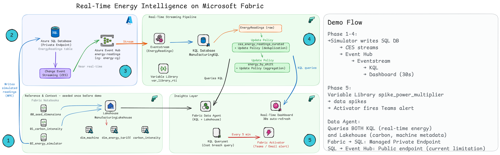
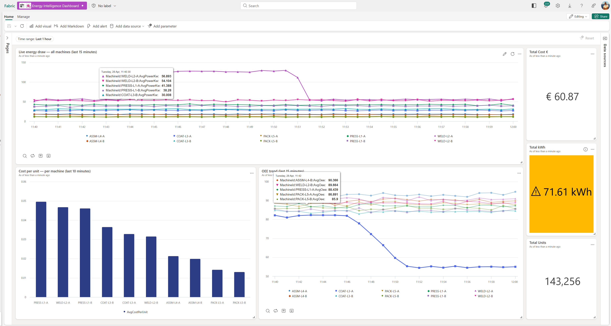
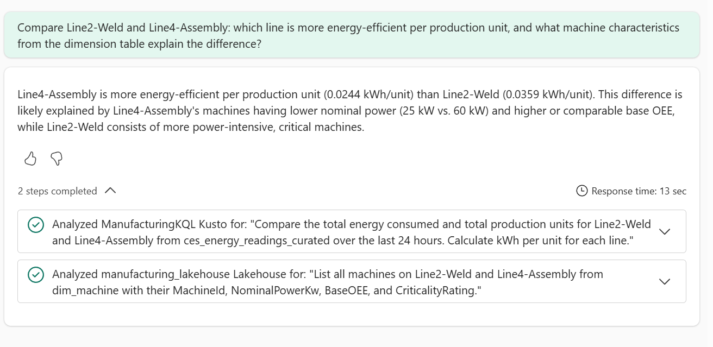
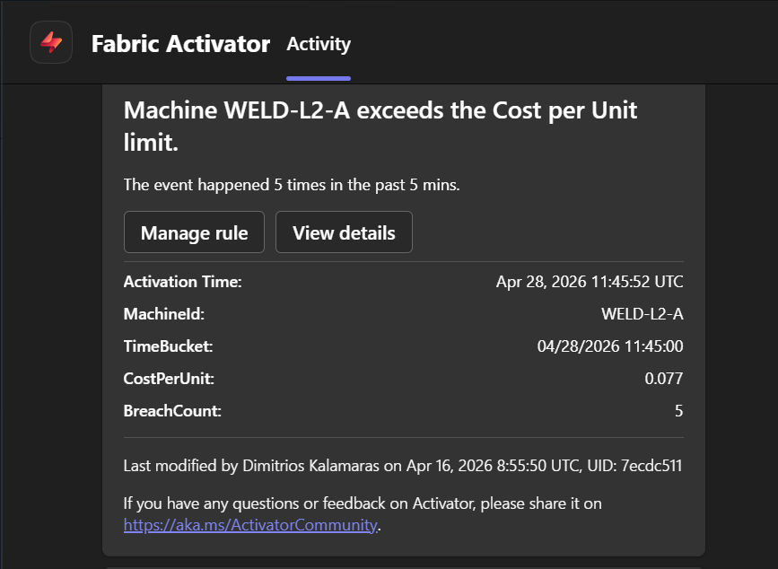

# From Sensor to Boardroom in Under a Minute — A Real-Time Energy Demo on Microsoft Fabric

> What if a plant manager could see a 2.3× power spike on a welding cell, get a Teams alert,
> *and* ask an AI agent "why is my cost-per-unit climbing on Line 2?" — all before the next
> coffee break finishes brewing?

This isn't a slide. It's a working, end-to-end demo you can clone today.

**The pipeline, in one breath:**
Azure SQL Server 2025 → **Change Event Streaming** → Event Hub → Fabric Eventstream →
KQL Database → **Real-Time Dashboard** + **Fabric Data Agent** + **Activator** → Teams alert.

---

## The story it tells

### 🔥 A loud anomaly — and 🤫 a silent one, side by side

- **The loud one:** A welding cell surges to 2.3× nominal power. Cost-per-unit spikes. The dashboard screams.
- **The silent one:** A coating line's OEE drifts from 82% → 61% while power stays flat. Same energy in, fewer good units out — the kind of bleed that costs manufacturers millions before anyone notices.

### 🧠 A unified agent that crosses data stores

The Fabric Data Agent answers compound questions across **real-time KQL** *and* **Lakehouse Delta** in one conversation — enriched with carbon intensity (gCO₂/kWh) for the sustainability story your CFO now asks about.

### ⚡ A live "panic button" — sensor to Teams in 30 seconds

Flip one variable in the Fabric Variable Library, watch the spike propagate end-to-end, and let Activator fire a Teams notification with **zero code changes on stage**.

---

## Why it's worth your 10 minutes

- ✅ Real industrial signal shape — Gaussian noise + sigmoid spike ramps, not flat synthetic lines
- ✅ Private endpoint from Fabric to SQL — no public exposure, enterprise-grade by default
- ✅ Update policies (not materialized views) so the **Data Agent can actually query the curated tables**
- ✅ A 30-minute pre-flight checklist and a "if something goes wrong" runbook — built for live demos, not just screenshots

📦 **Clone the full repo — schemas, notebooks, dashboards, and agent prompts:**
👉 `https://github.com/DimKal-Org/fabric-real-time-energy-intelligence`

*If you've ever wanted to show a manufacturing audience what Fabric actually feels like under load — start here.*